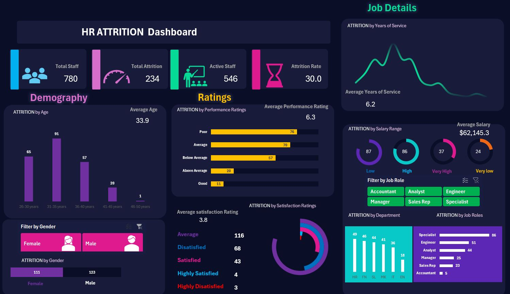
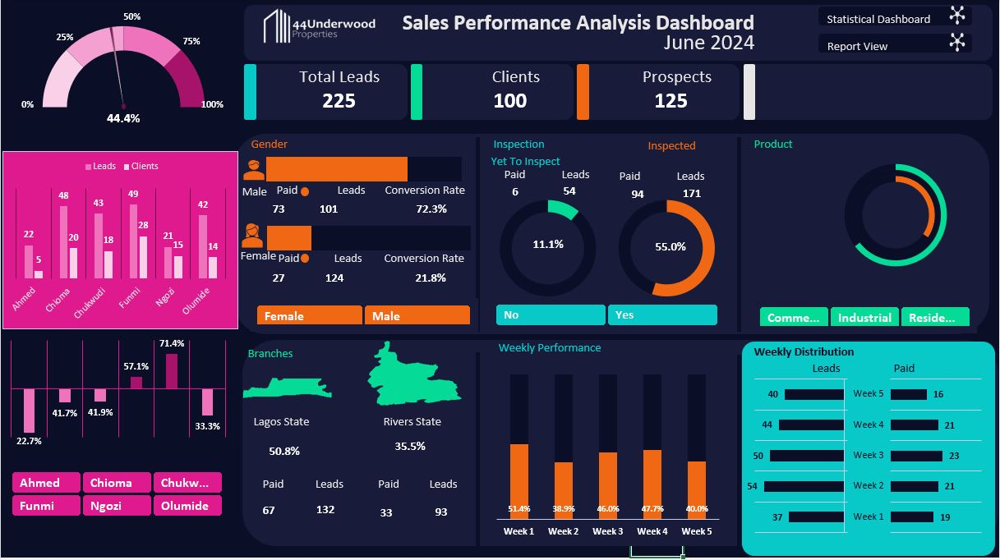
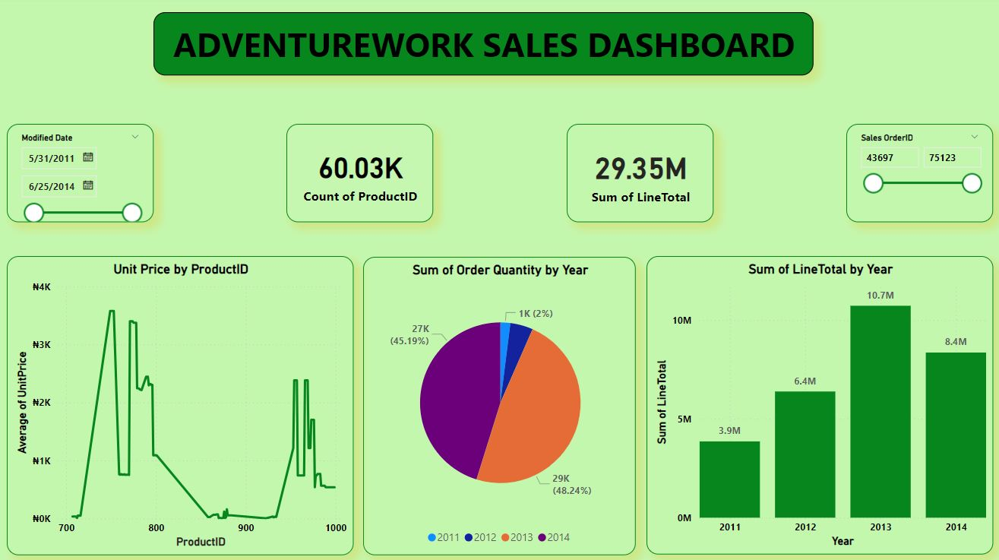

# Portfolio
<!--Section 1: Introduce your self-->
## ABOUT ME

Hello there, welcome to my portfolio! 
I am a data analyst passionate about turning raw data into actionable insights, I specialize in unraveling complex datasets to drive decision-making and business growth. You'll find a showcase of projects where I blend data storytelling, statistical analysis, and visualization tools to solve real-world problems. Dive in to explore how I transform numbers into narratives that fuel smarter strategies and impactful outcomes!

<!--Mention your top/relevant skills here - core and soft skills-->
## WHAT I DO

*As a versatile data analyst, I am skilled in Data Management, Data Analysis, Data visualization and statiscal analysis. I am proficcient in the use of MS Excell, Power Query, Power BI and SQL.*

<!--Section 2: List 3-4 key projects-->
## MY PORTFOLIO 

*An overview of some of the projects I've been working on.*

**In modern-day competitive business landscape, employee retention is paramount for organizational success. High turnover rates can lead to increased recruitment costs, loss of institutional knowledge, and decreased productivity. The Attrition Analysis project for this company aimed to identify key factors contributing to employee attrition and provide actionable insights to mitigate turnover risks.

The project involved a comprehensive analysis of employee data, including but not limited to demographic information, job roles, performance metrics, compensation, and tenure. By leveraging advanced statistical techniques, I was able to uncover patterns and trends associated with attrition within the organization.
.**
 

<tr>
  <td>⬇️</td>
<td><a href="docs/docs/docs/Human Resources_Attrition Analysis.xlsx">Downloa My Project File</a></td>
 </tr>

**Sales Analysis of a company that is into property with branches in two regions. In this analysis I analysed the sales conversion for the sales representative and the performance of the company for 3 years. Identified the production that had the greatest impact on the bottomline**

 <tr>
    <td>⬇️</td>
    <td><a href="docs/docs/SAMUEL AVOKENYE ESIEBOMA CV-Data-Analyst_A092024.pdf">Download my CV</a></td>
</tr>

**Power BI project: In this project I analyze the sales performance of a global trading company.**

<tr>
    <td>⬇️</td>
    <td><a href="docs/docs/SAMUEL AVOKENYE ESIEBOMA CV-Data-Analyst_A092024.pdf">Download my CV</a></td>
</tr>

## MY SKILLS (Core)

*Data Cleaning & Preparation, Data Analysis & Interpretation, Predictive Modelling & Forecasting, Statistical Analysis, Data Visualization (Power BI), Advanced MS Excel & Spreadsheet Analysis, Business Intelligence & Reporting.*

## MY SOFT SKILLS
*Problem solving skills, Effective Communication skills, Good writing skills, interpersonal skills, Leadership, adaptability skills, Listening and providing advice to resolve conflicts*

## CONTACT DETAILS

*Let’s connect, collaborate and keep the conversation going to make a difference together!*
<ta  ble>
  <tbody>
    <tr>
      <td>📧</td>
      <td><a href="mailto:esiebomasamuel@yahoo.com">esiebomasamuel@yahoo.com</a></td>
    </tr>
    <tr>
      <td>📞</td>
      <td>(44) 742-323-3863</td>
    </tr>
    <tr>
      <td>📍</td>
      <td>United Kingdom</td>
    </tr>
    <tr>
      <td>⬇️</td>
      <td><a href="docs/docs/SAMUEL AVOKENYE ESIEBOMA CV-Data-Analyst_A092024.pdf">Download my CV</a></td>
    </tr>
    <tr>
      <td>🌐</td>
      <td><a href="https://esieboma.github.io/Portfolio/">Check me out on LinkedIn</a></td>
    </tr>
    <tr>
 </tbody>
</table>

   

